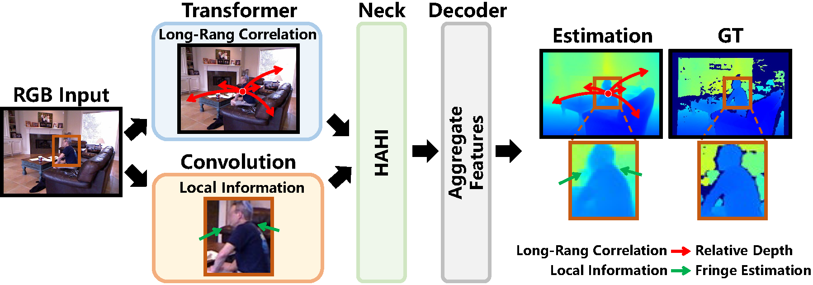
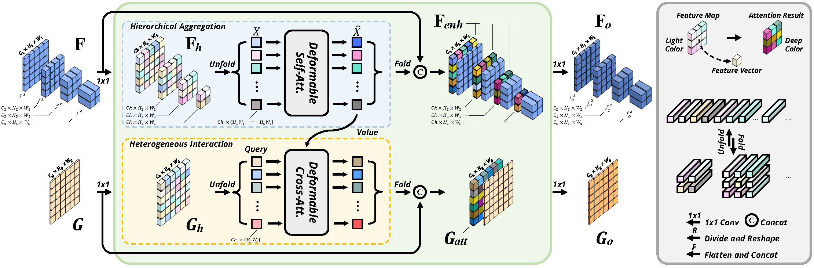

## Introduction


This is the official implementation of **DepthFormer: Exploiting Long-Range Correlation and Local Information for Accurate Monocular Depth Estimation**.

DepthFormer Motivation:

Hierarchical Aggregation and Heterogeneous Interaction (HAHI) Module:


We develop this supervised depth estimation toolbox based on [MMSegmentation](https://github.com/open-mmlab/mmsegmentation).

### Major features

- Based on MMSegmentation, our banchmark achieves unify evaluation, independent module design, and high efficiency of training. 

## Installation

### Requirement:
Linux, CUDA>=9.2, GCC>=5.4, Python>=3.7

### SetUp:
We ran our experiments with PyTorch 1.8.0, CUDA 11.1, Python 3.7, and Ubuntu 20.04. Other settings that satisfact the requirement would work.

We recommend you to use Anaconda to create a conda environment:

```shell
conda create -n DepthFormer python=3.7
conda activate DepthFormer
```

Install Pytorch:
```shell
conda install pytorch==1.8.0 torchvision==0.9.0 torchaudio==0.8.0 cudatoolkit=11.1 -c pytorch -c conda-forge
```

Then, install other dependencies of the codebase (Install MMCV and build our codebase):
```shell
pip install mmcv-full==1.3.13 -f https://download.openmmlab.com/mmcv/dist/cu111/torch1.8.0/index.html

pip install -e . (In the root path of this repo)
```
If you have a different evironment, just follwing the installation docs of MMSegmentation (see [get_started.md](docs/get_started.md)).

Finally, let's build the deformable attention module:
```shell
cd ./models/necks/ops
sh ./make.sh
python test.py
```

If training, you should also install the tensorboard:
```shell
pip install future tensorboard
```

## Get Started
Download [KITTI](http://www.cvlibs.net/datasets/kitti/eval_depth.php?benchmark=depth_prediction) and [NYU](https://github.com/cogaplex-bts/bts/tree/master/pytorch).

Put the split files (in ./splits) in dataset folder.

Prepare the dataset following the annotation in mmdepth/datasets/kitti.py and mmdepth/datasets/nyu.py.

Download our pre-trained models: [KITTI](https://drive.google.com/file/d/1I3z8zuDdEjrI1eP34xKVDAnGqbnTdPRi/view?usp=sharing) and [NYU](https://drive.google.com/file/d/1tjlsuubPa73hN8WZpn-2PObh39bd8buM/view?usp=sharing).

Direct Evaluation:
```shell
KITTI Evaluation
bash ./tools/dist_test.sh configs_depth/depthformer/depthformer_large_p4_w12_22k_kitti.py nfs/checkpoints/depthformer_swinL_kitti.pth num_gpus --eval eigen

NYU Evaluation
bash ./tools/dist_test.sh configs_depth/depthformer/depthformer_large_p4_w12_22k_nyu.py nfs/checkpoints/depthformer_swinL_nyu.pth num_gpus --eval eigen
```

Or you can train the models by yourself:
```shell
KITTI Training
bash ./tools/dist_train.sh configs_depth/depthformer/depthformer_large_p4_w12_22k_kitti.py nfs/checkpoints/depthformer_swinL_kitti.pth num_gpus --work-dir xxx

NYU Training
bash ./tools/dist_train.sh configs_depth/depthformer/depthformer_large_p4_w12_22k_nyu.py nfs/checkpoints/depthformer_swinL_nyu.pth num_gpus --work-dir xxx
```

## Tips
This is an anonymous reviewing version, all the experiment settings are provided in the mmdepth/configs.

We will add some scripts to prepare the datasets.

We will remove unnecessary codes and add features of Self-supervised Training with MonoVideo and Stereo Images.
